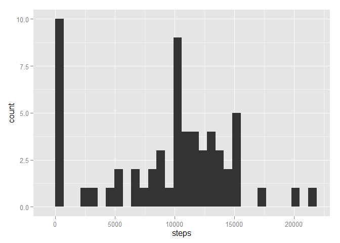
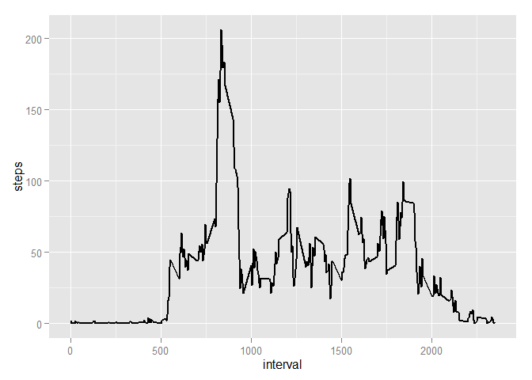
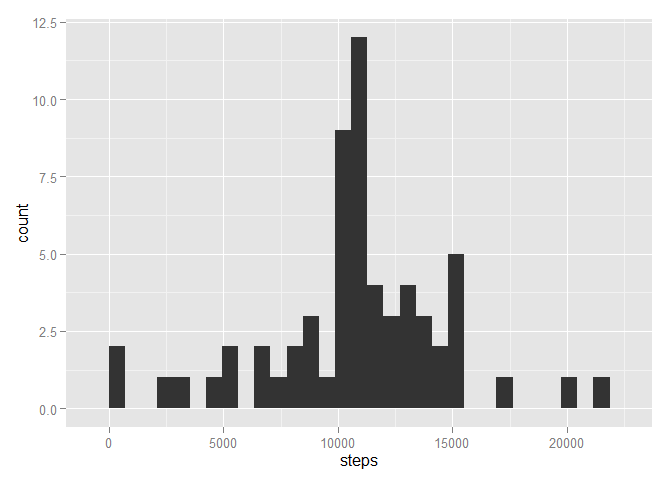
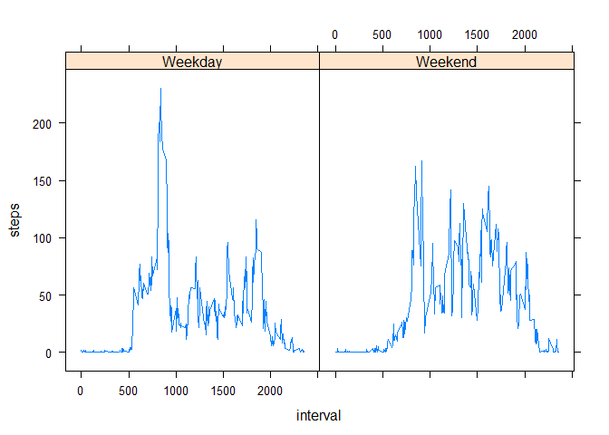

# Reproducible Research: Peer Assessment 1
Add in Libraries

```r
library(dplyr)
library(ggplot2)
library(lattice)
```

## Loading and preprocessing the data
Loading in data, and changing the "date" column to date format.


```r
data <- read.csv("c:/program files/r/RepData_PeerAssessment1/activity/activity.csv",
                 stringsAsFactors = F)
data$date <- as.Date(data$date)  #transform dates into date class
data$date <- format(data$date, "%Y/%m/%d")  #adjust format to exclude time
```

## What is mean total number of steps taken per day?
Aggregate steps by day

```r
daily.steps <- summarize(group_by(data, date), sum(steps, na.rm=T))
names(daily.steps) <- c("date", "steps")
```
####Histogram of Daily Activity

```r
ggplot(data=daily.steps, aes(x=steps)) + geom_histogram()
```

```
## stat_bin: binwidth defaulted to range/30. Use 'binwidth = x' to adjust this.
```

 

####Mean Steps per Day

```r
mean(daily.steps$steps, na.rm=T)
```

```
## [1] 9354.23
```

####Median Steps per Day

```r
median(daily.steps$steps, na.rm=T)
```

```
## [1] 10395
```

## What is the average daily activity pattern?
Summarize data by avg steps per interval

```r
time.steps <- summarize(group_by(data, interval), mean(steps, na.rm=T))
names(time.steps) <- c("interval", "steps")
```

####Time Series plot of avg steps per interval

```r
ggplot(data=time.steps, aes(x=interval, y=steps)) + geom_line(lwd=1)
```

 

####Find the interval with the highest avg steps

```r
time.steps[which(time.steps$steps == max(time.steps$steps)),]
```

```
## Source: local data frame [1 x 2]
## 
##   interval    steps
## 1      835 206.1698
```

## Imputing missing values
####Number of NA rows

```r
na.data <- data[which(complete.cases(data) == F),]
nrow(na.data)
```

```
## [1] 2304
```


####Fill in missing data with interval averages

```r
joindata <- inner_join(na.data, time.steps, by="interval")
joindata <- joindata[,c(4,3,1)]
names(joindata) <- c("steps", "date", "interval")
clean.data <- rbind(data[which(complete.cases(data) == T),],joindata) %>%
        arrange(date, interval)
```

Aggregate steps by day

```r
clean.daily.steps <- summarize(group_by(clean.data, date), sum(steps))
names(clean.daily.steps) <- c("date", "steps")
```

####Histogram of Daily Activity

```r
ggplot(data=clean.daily.steps, aes(x=steps)) + geom_histogram()
```

```
## stat_bin: binwidth defaulted to range/30. Use 'binwidth = x' to adjust this.
```

 


####Mean Steps per Day

```r
mean(clean.daily.steps$steps)
```

```
## [1] 10766.19
```

####Median Steps per Day

```r
median(clean.daily.steps$steps)
```

```
## [1] 10766.19
```

## Are there differences in activity patterns between weekdays and weekends?

####Add Weekend/Weekday Classifier

```r
clean.data$day <- weekdays(as.Date(clean.data$date))
for (i in 1:nrow(clean.data)) {
        if (clean.data$day[i] == "Saturday") 
                {clean.data$day[i] <- "Weekend"}
        else if (clean.data$day[i] == "Sunday")
                {clean.data$day[i] <- "Weekend"}
        else {clean.data$day[i] <- "Weekday"}
}
```

####Panel Plot showing weekend/weekday activity

```r
clean.interval.data <- summarize(group_by(clean.data, interval, day), mean(steps))
names(clean.interval.data) <- c("interval", "day", "steps")
xyplot(steps ~ interval | day, data=clean.interval.data, type="l")
```

 
